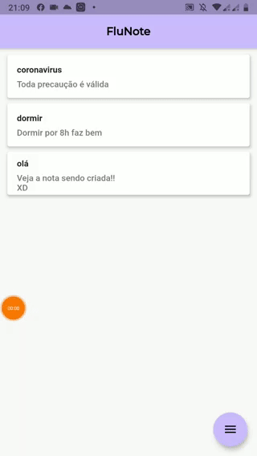
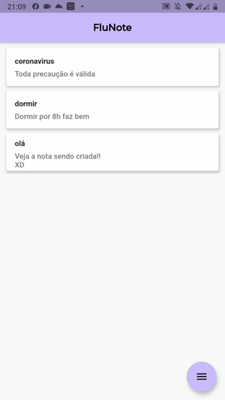
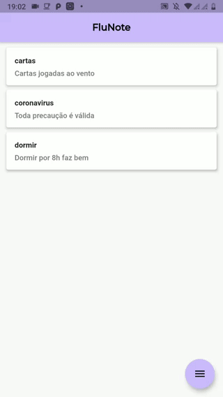

# NotasApp

Um mockup produzido com propósito de estudo

## Stacks

- Modular: estrutura de projeto orientado a modules; 
- Injeção de Dependência;
- Controle de Rotas;
- Sistema de "Singleton Descartáveis";
- Mobx: gerência de estados;
- Moor: persistência de dados offline.

## Features

### Dark Mode

### Smart UI Components

### Data Persistense

## GIF
